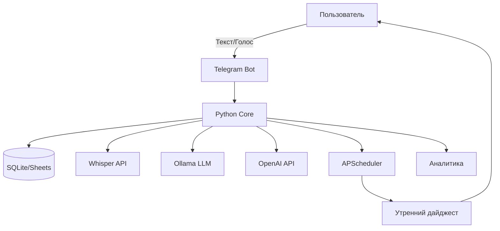

# README.md — Idea Bot

## 📌 Описание
**Idea Bot** — Telegram-бот для фиксации идей и привычек (текст/голос) с утренними дайджестами, аналитикой и streak-трекером.  
Проект документирован в отдельных файлах для удобства разработки и поддержки.

---

## 📂 Навигация по документации
- [`idea.md`](./idea.md) — концепция проекта: проблема, решение, ЦА, бизнес-модель, возможности развития.  
- [`vision.md`](./vision.md) — архитектура, стек технологий, паттерны проектирования, метрики, план развития.  
- [`workflow.md`](./workflow.md) — сценарии работы: текст, голос, дайджесты, fallback, аналитика, приватность.  
- [`conventions.md`](./conventions.md) — правила кодирования: структура проекта, PEP8, тестирование, Docker, безопасность.  
- [`tasklist.md`](./tasklist.md) — пошаговый план разработки по итерациям (MVP → голос → аналитика → интеграции → деплой).

---

## 🏗 Диаграмма архитектуры


---

## 🚀 Быстрый старт
1. Клонируйте репозиторий:
```bash
git clone https://github.com/username/idea-bot.git
cd idea-bot
```

2. Создайте и заполните `.env` (пример в `.env.example`):
```env
TELEGRAM_BOT_TOKEN=...
OPENAI_API_KEY=...
OLLAMA_BASE_URL=http://localhost:11434
DATABASE_URL=sqlite:///ideas.db
```

3. Соберите контейнер:
```bash
docker-compose up --build
```

4. Запустите бота:
```bash
python -m src.main
```

---

## 🔄 Обновление проекта (через GitHub)
1. Перейдите в директорию проекта:
```bash
cd idea-bot
```

2. Обновите код до последней версии:
```bash
git pull origin main
```

3. Обновите зависимости (если изменился `requirements.txt`):
```bash
pip install -r requirements.txt
```

4. Пересоберите контейнер (если используете Docker):
```bash
docker-compose up --build -d
```

5. Проверьте актуальность `.env` (сравните с `.env.example`).

После этого проект будет обновлён без потери данных.

---

## 🧩 Основные функции
- Фиксация идей: текст и голос.  
- Автоматическая транскрибация голосовых сообщений (Whisper).  
- Утренние дайджесты.  
- Подсчёт streak.  
- Аналитика и статистика.  
- Экспорт в CSV/JSON/Google Sheets.  
- Персонализация (время дайджеста, категории, теги).

---

## 🔐 Безопасность и конфиденциальность
- Все токены и ключи в `.env`.  
- Локальная обработка (Ollama приоритет).  
- Шифрование и минимизация логов.  
- Контент-фильтрация и защита от спама.

---

## 🧪 Тестирование
- Unit-тесты для бизнес-логики.  
- Интеграционные тесты для команд бота.  
- Mock/patch для внешних API.  
- Нагрузочные тесты.  
- CI/CD с автоматическим прогонами тестов.

---

## 📊 План развития
- MVP: базовые команды, сохранение в SQLite, дайджест.  
- Голосовые сообщения и интеграция Whisper.  
- Статистика и streak.  
- Интеграция с Google Sheets.  
- Расширенные функции: поиск, фильтрация, теги.  
- Мобильное приложение, геймификация, интеграции с Trello/Notion/Slack.

---

## 🗺 Roadmap (долгосрочные идеи)
- 📱 Мобильное приложение (Android/iOS).  
- 🎮 Геймификация (бейджи, уровни, мотивационные уведомления).  
- 🔗 Интеграции с Notion, Trello, Slack, Google Calendar.  
- 🤝 Многопользовательский режим (команды, семьи, сообщества).  
- 🧠 AI-аналитика: продвинутая категоризация, поиск трендов, рекомендации.  
- ☁️ Облачный деплой с масштабированием (Kubernetes, Docker Swarm).

---

## 👥 Авторы и вклад
- Автор: Евгений.  
- Поддержка: ChatGPT (структура, документация, кодовые шаблоны).

---

## 📄 Лицензия
MIT (может быть изменена под нужды проекта).
